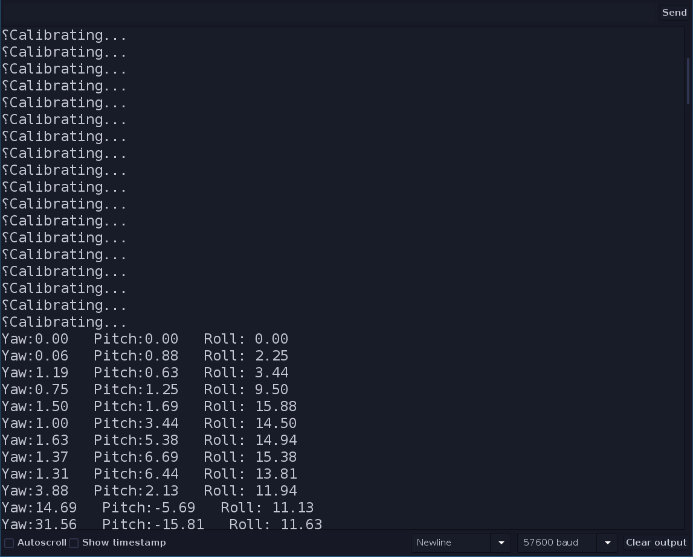

# Head tracker with an ardunion and a BNO055 9-axis absolute orientation sensor

I made a very light head tracker using the [Adafruit BNO055 sensor](https://www.adafruit.com/product/2472) and the associated [Arduino library](https://learn.adafruit.com/adafruit-bno055-absolute-orientation-sensor/overview). I found this sensor much more reliable then others such as the MPU 6050 which had constant problems with yaw drift.

Here's version 0.1 of the Arduino sketch. I use yaw and pitch only though roll works fine. For future versions I will try position as well; in play I've found it more trouble that it's worth with other accelerometer sensors, but will see how this goes.

This work is based on the [Hatire Arduino](https://sourceforge.net/projects/hatire/files/ARDUINO/) sketch, and the example code with the Adafruit library.

Here's the terrible prototype:

## Summary of the build process

1. Hook up the sensor to your Arduino. I used an Arduino Nano. Pins A4 and A5 should connect to the SDA and SCL pins on the sensor respectively. Connect 3v3 and GND from the Arduno to VIN and GND on the sensor. 
2. For testing purposes, uncomment this line at the top of the file: `// #define TESTING`
3. Load the sketch onto the Arduino. 
4. The chip takes a good few seconds to calibrate itself, and I find it needs to be wiggled around a bit for this to complete successfully.
5. Examine the serial monitor, it should look like this: 

Move the unit around a bit and check that the results are updating as expected. Send the unit a "Z" and an "R" and verify it re-zeroes and re-initializes.

1. Comment out the `#define TESTING` line and re-upload the sketch.
2. Configure Opentrack as follows:

- Input: Hatire Arduino

- (Click the little settings button next to that)
- Under general, make sure the right serial port is selected. Disable X, Y and Z.
    
- Under "Command", enter the following and ensure the baud rate is set to 57600:
    

1. Start tracking. Give the unit a moment to calibrate, don't forget to wiggle it around. The reset and zero buttons in the config should work as expected.

I used this [enclosure](https://www.thingiverse.com/thing:3536115) with some holes cut for a velcro. I will tinker with this and upload a more usable version.

Happy gaming!

